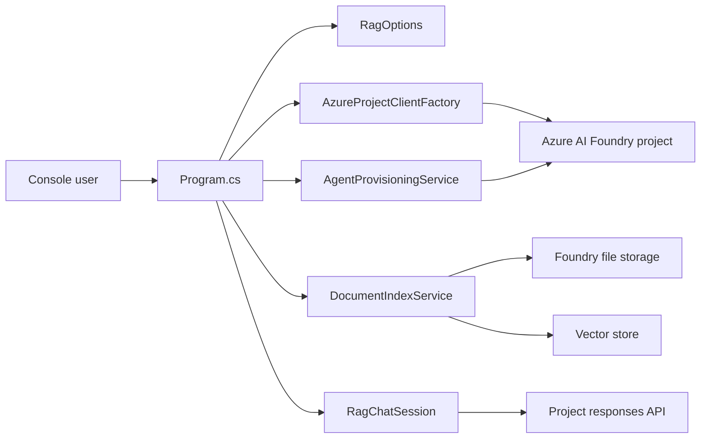

# Azure RAG Librarian

Azure RAG Librarian is a .NET console application that demonstrates a retrieval-augmented generation workflow with Azure AI Foundry. It uploads a local document, creates or reuses a vector store, registers a Foundry project agent with file search, and starts an interactive Q&A session over the indexed content.

This project is intentionally small enough to read in one sitting, but structured like production code: configuration is validated, Azure setup is isolated from the CLI, generated files are ignored, and core behavior has unit coverage.

## Architecture



## Prerequisites

- .NET 9 SDK
- An Azure AI Foundry project
- A deployed chat model, such as `gpt-4o-mini`
- Azure CLI login or another credential supported by `DefaultAzureCredential`
- Permission to create files, vector stores, and project agents in the Foundry project

## Setup

Clone the repository, then restore dependencies:

```powershell
dotnet restore AzureRagLibrarian.sln
```

Copy the example settings file and fill in your Foundry project endpoint:

```powershell
Copy-Item AzureRagLibrarian\appsettings.example.json AzureRagLibrarian\appsettings.json
```

The app supports these settings:

| Key | Required | Description |
| --- | --- | --- |
| `AzureAI:ProjectEndpoint` | Yes | Azure AI Foundry project endpoint. |
| `AzureAI:TenantId` | No | Tenant used by `DefaultAzureCredential`. |
| `AzureAI:ModelDeploymentName` | No | Chat model deployment name. Defaults to `gpt-4o-mini`. |
| `Rag:DocumentPath` | No | Local document to upload. Defaults to `samples/quiet-hours.txt`. |
| `Rag:VectorStoreName` | No | Vector store name. Defaults to `quiet-hours-vector-store`. |
| `Rag:AgentName` | No | Project agent name. Defaults to `quiet-hours-librarian`. |

You can also set configuration with environment variables, using either `AzureAI__ProjectEndpoint` style keys or `AzureAI_ProjectEndpoint` style keys.

## Run

```powershell
dotnet run --project AzureRagLibrarian\AzureRagLibrarian.csproj
```

Try asking:

- When do Quiet Hours begin?
- Who inspects the clocktower pendulums?
- What changed after the Merchant Guild accepted Quiet Hours?
- Which services continue during Quiet Hours?

Type `exit` or press Enter on a blank prompt to end the session.

## Test

```powershell
dotnet test AzureRagLibrarian.sln
```

The tests cover configuration validation, default naming, document path checks, and chat-loop exit handling. Live Azure calls are intentionally kept out of unit tests.

## Azure resources and cost

Running the app can create or reuse:

- A file in Azure AI Foundry project storage
- A vector store
- A project agent version
- Model inference requests during chat

Clean up unused files, vector stores, and agents in Azure AI Foundry when you are finished. Model and storage usage may incur Azure charges depending on your subscription and deployment.

## Portfolio notes

This repository demonstrates:

- Typed configuration and clear startup validation
- Separation between CLI flow, Azure client creation, indexing, agent setup, and chat behavior
- Safe sample data suitable for public GitHub
- Unit tests around local behavior without requiring cloud credentials
- GitHub-ready documentation and repository hygiene

## License

MIT. See [LICENSE](LICENSE).
