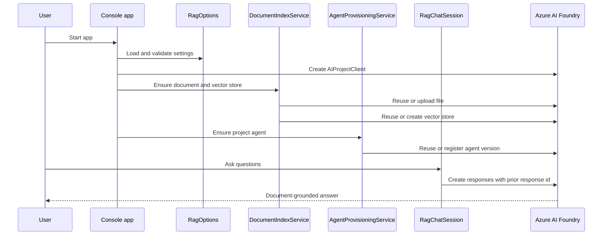

# Architecture

Azure RAG Librarian is split into small services so the cloud setup and the console workflow can be understood independently.

## Main components

- `Program.cs` coordinates startup, validation, indexing, agent provisioning, and chat.
- `RagOptions` loads required and optional settings from JSON, user secrets, and environment variables.
- `DocumentIndexService` owns Foundry file upload and vector store creation/reuse.
- `AgentProvisioningService` owns project agent lookup and registration.
- `RagChatSession` owns the interactive conversation loop.

Unit tests cover the local behavior that should not require an Azure subscription.
